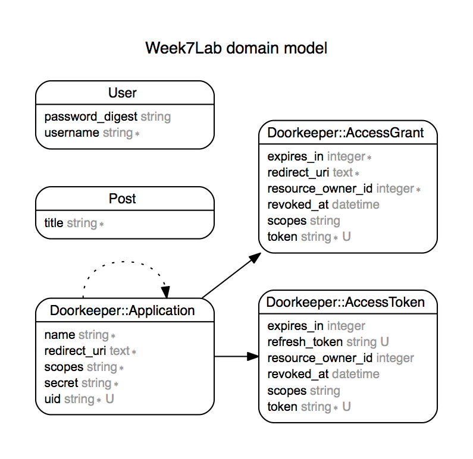

Secure API
==========

GET /api/posts to return all posts

GET /api/posts/:id gives details of a post

POST /api/posts creates a post

PUT /api/posts/:id updates a post

DELETE /api/posts/:id deletes a post

Post /api/ registration

doorkeeper

post/oath/token

 Model
======
Posts title:string
